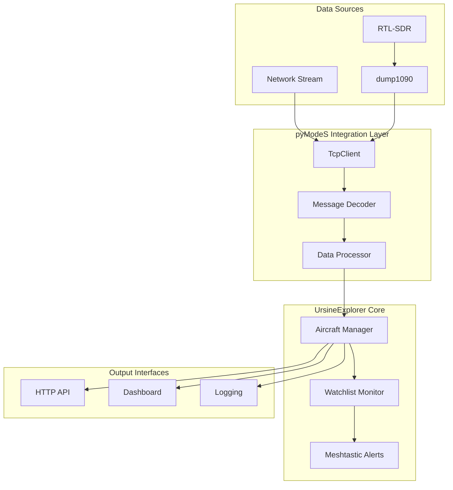

# Design Document

## Overview

This design integrates the proven pyModeS library architecture into the UrsineExplorer ADS-B receiver system to improve reliability, accuracy, and maintainability. The design maintains backward compatibility while leveraging the mature message decoding capabilities of pyModeS.

The key improvement is replacing the current custom ADS-B decoding logic with pyModeS's battle-tested algorithms, while preserving the existing features like Meshtastic alerts, watchlist monitoring, and the dashboard interface.

## Architecture

### High-Level Architecture



### Component Architecture

The system will be restructured into these main components:

1. **Message Source Manager**: Handles connections to various ADS-B data sources
2. **pyModeS Decoder**: Integrates pyModeS library for message decoding
3. **Aircraft Data Manager**: Manages aircraft state and tracking
4. **Watchlist Monitor**: Monitors for target aircraft and triggers alerts
5. **API Server**: Provides HTTP endpoints for dashboard and external access
6. **Dashboard Interface**: Terminal-based real-time display

## Components and Interfaces

### 1. Message Source Manager

**Purpose**: Manage connections to different ADS-B data sources using pyModeS's proven connection handling.

**Key Classes**:
- `MessageSourceManager`: Main coordinator
- `Dump1090Source`: Handles dump1090 connections (JSON and raw)
- `NetworkSource`: Handles network streams (raw, beast, skysense)
- `RTLSDRSource`: Optional direct RTL-SDR support

**Interfaces**:
```python
class MessageSource:
    def connect(self) -> bool
    def disconnect(self) -> None
    def get_messages(self) -> List[Tuple[str, float]]  # (message, timestamp)
    def is_connected(self) -> bool

class MessageSourceManager:
    def add_source(self, source: MessageSource) -> None
    def start_collection(self) -> None
    def stop_collection(self) -> None
    def get_message_stream(self) -> Iterator[Tuple[str, float]]
```

### 2. pyModeS Decoder Integration

**Purpose**: Leverage pyModeS's robust message decoding capabilities.

**Key Classes**:
- `PyModeSDecode`: Wrapper around pyModeS decode functionality
- `MessageValidator`: CRC validation and message filtering
- `DecodedMessage`: Structured representation of decoded data

**Interfaces**:
```python
class PyModeSDecode:
    def __init__(self, lat_ref: float = None, lon_ref: float = None)
    def process_messages(self, messages: List[Tuple[str, float]]) -> Dict[str, Aircraft]
    def get_aircraft_data(self) -> Dict[str, Aircraft]
    def clear_old_aircraft(self, timeout_seconds: int = 300) -> None

class DecodedMessage:
    icao: str
    message_type: str
    timestamp: float
    data: Dict[str, Any]
```

### 3. Enhanced Aircraft Data Manager

**Purpose**: Manage aircraft state with improved data validation and processing.

**Key Classes**:
- `EnhancedAircraft`: Extended aircraft class with pyModeS data
- `AircraftTracker`: Manages aircraft lifecycle and data updates
- `PositionCalculator`: Handles CPR position decoding

**Interfaces**:
```python
class EnhancedAircraft:
    # Core identification
    icao: str
    callsign: Optional[str]
    
    # Position data (using pyModeS algorithms)
    latitude: Optional[float]
    longitude: Optional[float]
    altitude: Optional[int]
    
    # Velocity data
    ground_speed: Optional[float]
    track: Optional[float]
    vertical_rate: Optional[float]
    
    # Enhanced data from pyModeS
    true_airspeed: Optional[float]
    indicated_airspeed: Optional[float]
    mach_number: Optional[float]
    heading: Optional[float]
    roll_angle: Optional[float]
    
    # Uncertainty and accuracy metrics
    navigation_uncertainty: Optional[Dict[str, float]]
    
    # Metadata
    first_seen: datetime
    last_seen: datetime
    message_count: int
    is_watchlist: bool
    
    def update_from_pymodes(self, pymodes_data: Dict) -> None
    def to_api_dict(self) -> Dict[str, Any]
    def calculate_age_seconds(self) -> int
```

### 4. Improved Watchlist Monitor

**Purpose**: Enhanced watchlist monitoring with better alert management.

**Key Classes**:
- `WatchlistMonitor`: Main monitoring logic
- `AlertThrottler`: Manages alert frequency and deduplication
- `MeshtasticInterface`: Improved Meshtastic communication

**Interfaces**:
```python
class WatchlistMonitor:
    def __init__(self, watchlist: Set[str], alert_interface: AlertInterface)
    def check_aircraft(self, aircraft: EnhancedAircraft) -> bool
    def update_watchlist(self, new_watchlist: Set[str]) -> None

class AlertInterface:
    def send_alert(self, aircraft: EnhancedAircraft, alert_type: str) -> bool
    def is_throttled(self, aircraft_icao: str) -> bool
```

## Data Models

### Enhanced Aircraft Data Structure

```python
@dataclass
class EnhancedAircraft:
    # Required fields
    icao: str
    first_seen: datetime
    last_seen: datetime
    
    # Optional identification
    callsign: Optional[str] = None
    
    # Position (using pyModeS CPR decoding)
    latitude: Optional[float] = None
    longitude: Optional[float] = None
    altitude_baro: Optional[int] = None
    altitude_gnss: Optional[int] = None
    
    # Velocity (enhanced with pyModeS)
    ground_speed: Optional[float] = None
    track_angle: Optional[float] = None
    vertical_rate: Optional[float] = None
    
    # Enhanced flight data
    true_airspeed: Optional[float] = None
    indicated_airspeed: Optional[float] = None
    mach_number: Optional[float] = None
    magnetic_heading: Optional[float] = None
    roll_angle: Optional[float] = None
    track_rate: Optional[float] = None
    
    # Navigation accuracy (from pyModeS)
    navigation_accuracy: Optional[Dict[str, float]] = None
    surveillance_status: Optional[str] = None
    
    # System metadata
    message_count: int = 0
    is_watchlist: bool = False
    data_sources: Set[str] = field(default_factory=set)
    
    # Raw pyModeS data for debugging
    raw_pymodes_data: Optional[Dict] = None
```

### Message Processing Pipeline

```python
class MessagePipeline:
    def __init__(self):
        self.sources = MessageSourceManager()
        self.decoder = PyModeSDecode()
        self.tracker = AircraftTracker()
        self.watchlist = WatchlistMonitor()
        
    def process_batch(self) -> None:
        # Get messages from all sources
        messages = self.sources.get_message_batch()
        
        # Decode using pyModeS
        decoded_aircraft = self.decoder.process_messages(messages)
        
        # Update aircraft tracking
        for icao, aircraft_data in decoded_aircraft.items():
            aircraft = self.tracker.update_aircraft(icao, aircraft_data)
            
            # Check watchlist
            if aircraft.is_watchlist:
                self.watchlist.check_aircraft(aircraft)
```

## Error Handling

### Message Validation Strategy

1. **CRC Validation**: Use pyModeS CRC checking for all messages
2. **Format Validation**: Validate message length and format before processing
3. **Data Range Validation**: Check decoded values are within reasonable ranges
4. **Temporal Validation**: Ensure message timestamps are reasonable

### Error Recovery

1. **Connection Failures**: Automatic reconnection with exponential backoff
2. **Decode Failures**: Log and skip invalid messages without crashing
3. **Data Inconsistencies**: Use pyModeS's built-in conflict resolution
4. **Resource Exhaustion**: Implement memory limits and cleanup

### Logging Strategy

```python
class ADSBLogger:
    def log_message_stats(self, processed: int, errors: int, rate: float) -> None
    def log_aircraft_update(self, icao: str, changes: Dict[str, Any]) -> None
    def log_watchlist_alert(self, aircraft: EnhancedAircraft) -> None
    def log_connection_event(self, source: str, event: str) -> None
    def log_decode_error(self, message: str, error: Exception) -> None
```

## Testing Strategy

### Unit Testing

1. **Message Decoding Tests**: Validate pyModeS integration with known test messages
2. **Aircraft Tracking Tests**: Test aircraft state management and updates
3. **Position Calculation Tests**: Verify CPR decoding accuracy
4. **Watchlist Tests**: Test alert triggering and throttling

### Integration Testing

1. **End-to-End Message Flow**: Test complete pipeline from source to output
2. **Multi-Source Testing**: Verify handling of multiple simultaneous sources
3. **Error Condition Testing**: Test recovery from various failure scenarios
4. **Performance Testing**: Validate message processing rates and memory usage

### Test Data

1. **Recorded Message Sets**: Use real ADS-B message captures for testing
2. **Synthetic Test Cases**: Generate specific scenarios for edge case testing
3. **pyModeS Test Suite**: Leverage existing pyModeS test cases

## Migration Strategy

### Phase 1: Core Integration
- Integrate pyModeS library
- Replace message decoding logic
- Maintain existing API compatibility

### Phase 2: Enhanced Features
- Add advanced aircraft data fields
- Improve position accuracy
- Enhanced error handling

### Phase 3: Optimization
- Performance tuning
- Memory optimization
- Advanced monitoring features

### Backward Compatibility

1. **Configuration**: Maintain existing config.json format
2. **API Endpoints**: Keep existing HTTP API structure
3. **Dashboard**: Preserve current dashboard functionality
4. **Alerts**: Maintain Meshtastic alert system

The design ensures that existing users can upgrade seamlessly while gaining the benefits of the more robust pyModeS-based implementation.